

  

# Gmeet 🎦

A "clone" of the video conferencing application, Meet, by Google LLC.

## Description
Gmeet is a video conferencing application that looks and functions almost alike one of the previous versions of Meet and was developed in Flutter. 
Gmeet supports group video calls for upto 7 people. 
It uses Agora SDK for video conferencing and Firestore database for live chat conversations. 
Similar to Meet, the host creates a meeting code that can be shared among people and
once the host accepts their requests to join, the requesters will be allowed to attend the meeting as long as the meeting is live.

## Features
- Group video call
- Chat conversation
- Google UI
- Private meetings
- Host privileges
- Screen-sharing (Yet to be implemented)
- Realtime captions (Yet to be implemented)

## Screenshots
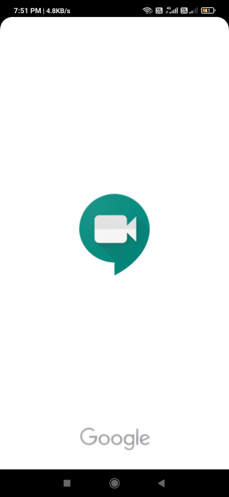 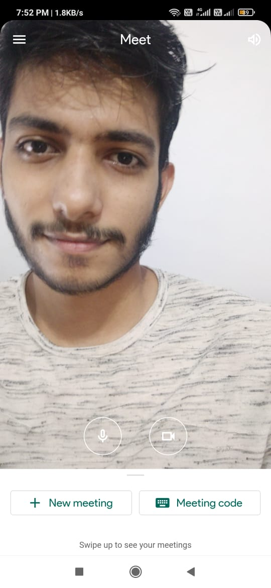 
 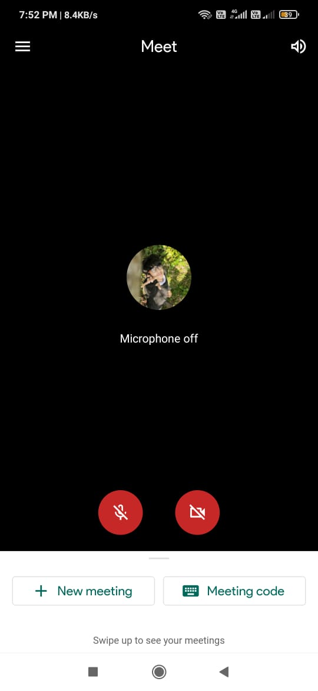 
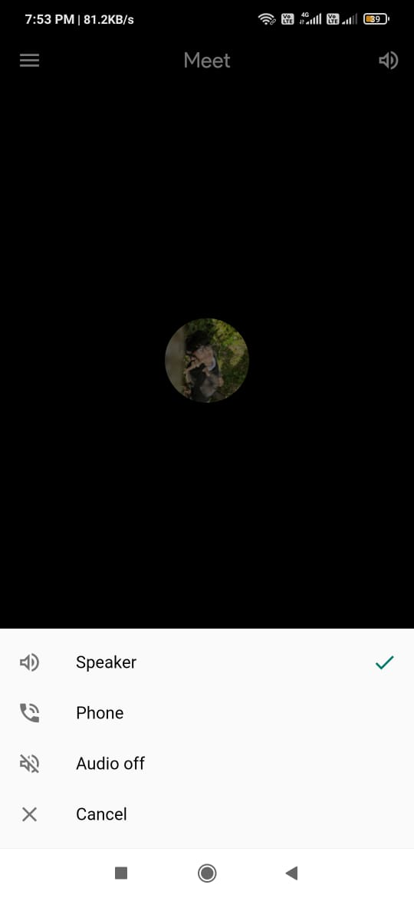 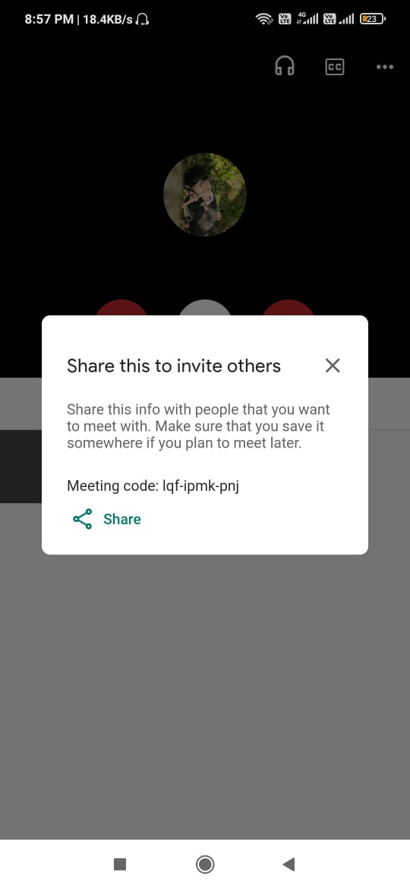 
  
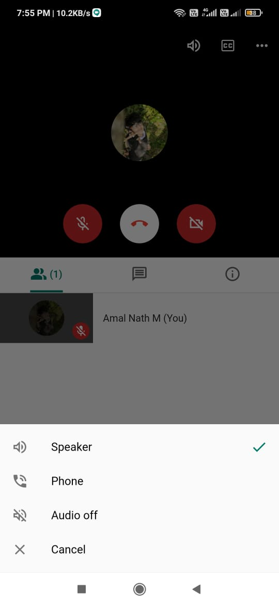 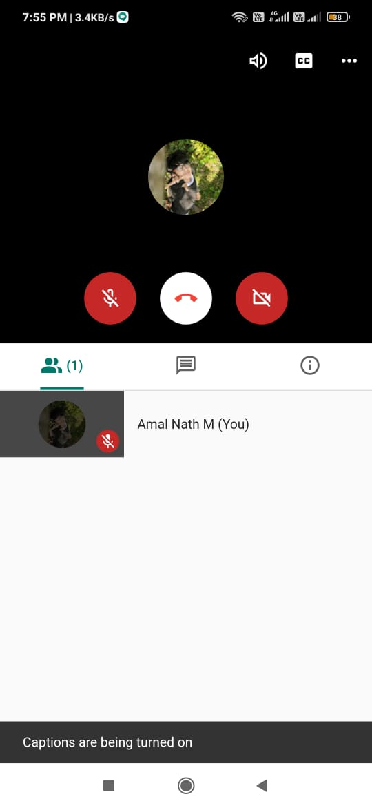 
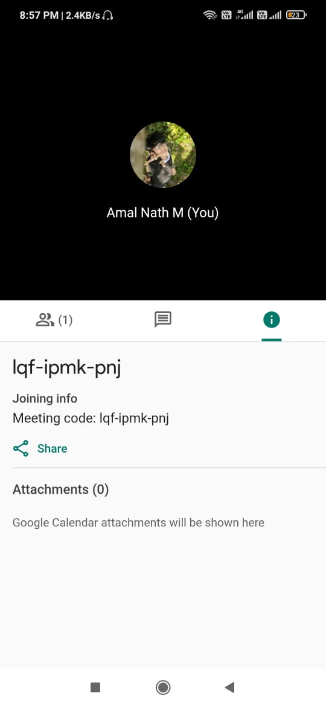 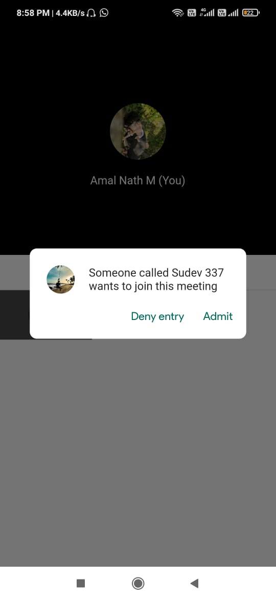 
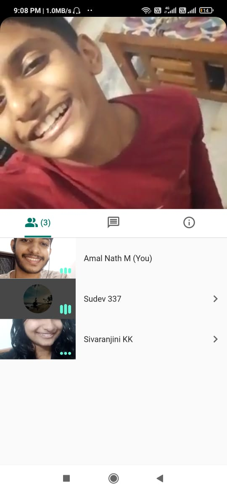 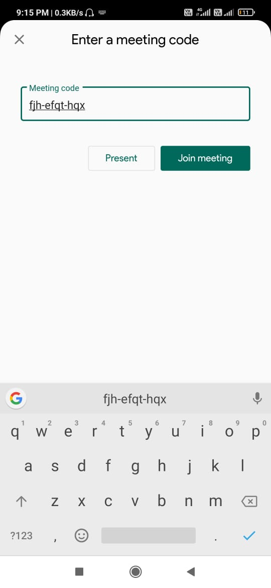 
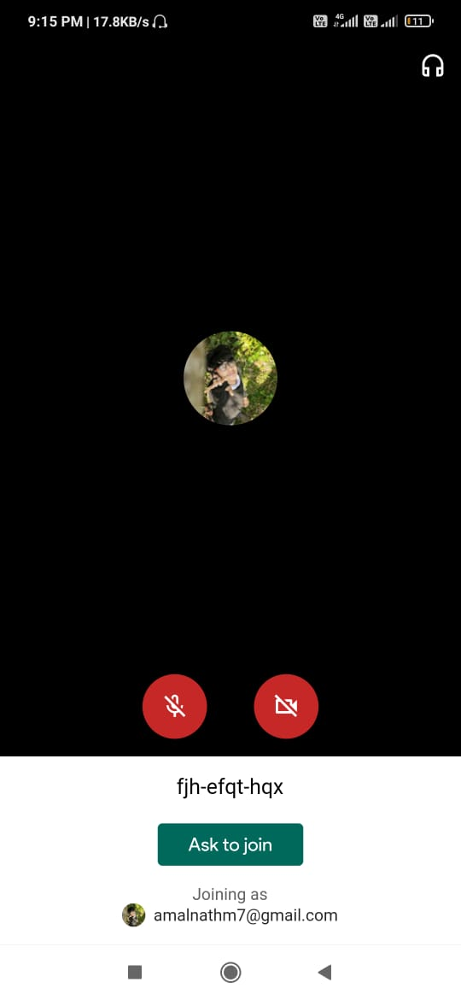 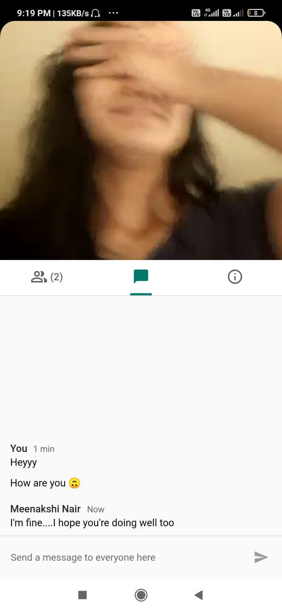 

## Installation
The latest APKs (for various Android binaries) are also uploaded. 
Download the suitable one (for most devices, arm64-v8a is preferred) and install it.

_Disclaimer:- This application was developed only for learning purposes and is not intended for any sort of Copyright breach._

##
### Meet 'em  all! 🙃🎉
